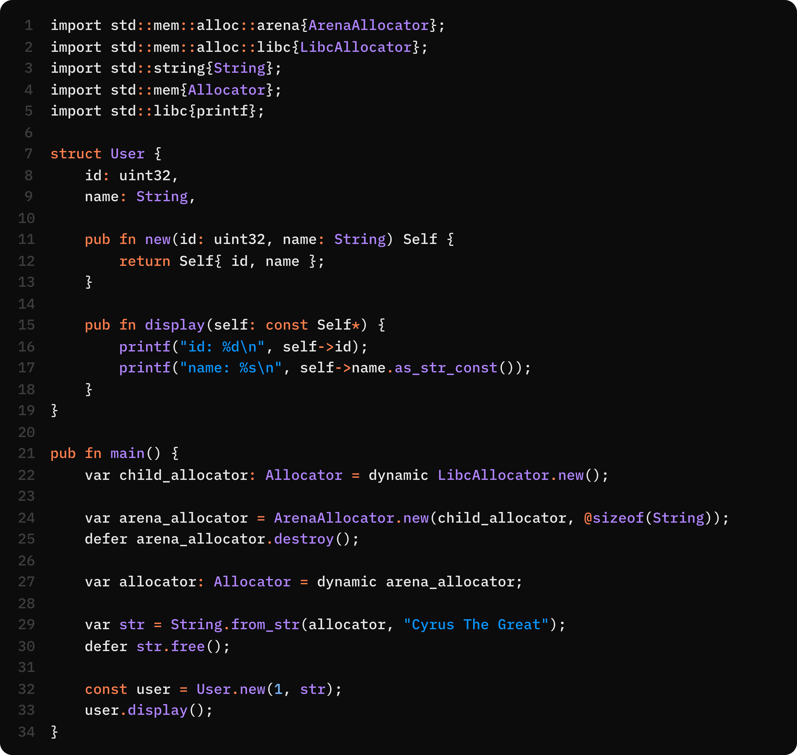

<h1 style="display: flex; align-items: center; gap: 10px;">
  
  Cyrus Programming Language
</h1>



<p>Cyrus is built to deliver:</p>
<ul>
  <li>Explicit control over the machine</li>
  <li>Clean, human-readable syntax</li>
  <li>Minimal abstractions</li>
  <li>High-performance execution</li>
  <li>Precise low-level interactions</li>
  <li>A strictly imperative/procedural paradigm</li>
</ul>

<p>Cyrus was born out of frustration with the creeping complexity in modern languages. While ecosystems like Rust and Go offer incredible features, they also introduce steep learning curves, heavy runtimes, or restrictive abstractions that many systems programmers simply don't need or want.</p>

<p>Cyrus makes a different bet: that simplicity, explicitness, and elegance can coexist without sacrificing a drop of performance.</p>

<p>This language is built for:</p>
<ul>
  <li>Systems developers who love C but want a modern evolution without garbage collection.</li>
  <li>Developers exhausted by Rust’s borrow checker but who still want modern, performant infrastructure.</li>
  <li>Embedded and OS-level engineers who need zero hidden runtime overhead and absolute memory control.</li>
  <li>Anyone looking for a beautiful, expressive, low-level language that respects your intelligence and experience.</li>
</ul>

## Philosophy: Developer in Control

Cyrus operates on a single, uncompromising principle: **The developer is in charge.**

The language doesn't try to outsmart you, hide the hardware, or wrap your decisions in automatic rules. We don't try to eliminate every bug through heavy compiler-enforced safety systems or introduce massive paradigm shifts.

Instead, Cyrus takes the proven concepts of systems programming and refines them. Every allocation, mutation, memory indirection, and dispatch strategy is explicitly declared in your code. When you read a Cyrus file, you know exactly what the machine is doing.

## Explicit Semantics

Cyrus requires explicit intent at every step. Nothing happens implicitly, quietly, or behind the scenes.

### Mutability You Can See

No need to scan backwards to figure out if a variable changes. The very first token tells you everything:

```cyrus
const max_retries = 5; // immutable, forever
var current_try = 0;   // mutable
```

### No Silent Truncation

C loves to silently convert types, dropping bits and masking bugs. Cyrus refuses to guess. Safe widening (like `int32` to `int64`) happens automatically, but if there is any risk of data loss or a signedness mismatch, you must explicitly authorize it with `@cast`:

```cyrus
const a: int32 = 300;
const b: int64 = a;               // OK: Safe widening
const c: int32 = @cast(int32, b); // OK: Explicit cast required
```

### Trackable Pointers

In Cyrus, a glance is all it takes to know if you are crossing a memory boundary. We use `.` for direct access and `->` for pointer indirection:

```cyrus
var box = Box { value: 1 };
var box2 = box.methodA(5)->methodB(50);
var box3 = box2->fieldA;

// The '->' tells you exactly where the pointer dereference happens
```

### Manual, Predictable Memory

There is no Garbage Collector. You allocate the memory, and you free it. The `defer` keyword ensures your cleanup runs exactly when the scope exits (in LIFO order), keeping resource management flat and readable:

```cyrus
import std::mem::libc{LibcAllocator};
import std::mem{Allocator};

pub fn main() {
    const allocator = LibcAllocator.new();

    var buffer: int32* = allocator.alloc(64 * @sizeof(int32));
    defer allocator.free(buffer);

    buffer[0] = 10;
}
```

## Total Machine Control

Cyrus trusts you to know what you're doing. It gives you the raw tools to map memory and talk to the hardware, and we expect you to handle the responsibility.

- **Bring your own allocator:** Custom allocators (stack, bump, libc) are first-class citizens using the `Allocator` interface.
- **Type punning:** Use `union` to reinterpret raw memory layouts without casting.
- **Pointer arithmetic:** Full support for GEP-based indexing and pointer math (`ptr + 5`).
- **Bare-metal ready:** Inline assembly, `extern` for seamless C ABI compatibility, and `naked` functions for writing interrupt handlers directly.

## Safety

Control comes at a cost. We do not bubble wrap your code; `data races`, `dangling pointers`, and `use after free` errors remain possible. This is not a flaw but a deliberate tradeoff for direct, unfiltered access to the machine.

The runtime enforces `bounds checking`, `null pointer access`, and `integer overflow`. For deeper debugging, we support sanitizers like `ASan` and `TSan`.

Variables are `zero initialized` by default. To opt out, use the `undefined` keyword to disable zero initialization.

## Language Overview

Here is a glimpse of what Cyrus looks like. For complete and up-to-date details on learning the language, please check out our [Documentation](https://cyrus-lang.ir/en/docs/getting-started/introduction), which evolves continuously alongside the project.

### Structs

Structs are user-defined composite types that group related data together. They map directly to memory with no hidden object headers or vtables.

```cyrus
struct User {
    pub name: uint8*,
    pub age: uint32,
    id: uint32 // private by default
}
```

Methods are defined inside the struct body using explicit receivers:

```cyrus
struct Counter {
    pub value: int32,

    pub fn increment(self: Self*) {
        self->value += 1;
    }

    pub fn reset(var self: Self) {
        self.value = 0; // operates on a local copy
    }
}

```

Cyrus also supports anonymous **unnamed structs** for inline use or quick configurations. Named and unnamed structs are fully compatible if their field names and types match exactly:

```cyrus
struct Point {
    pub x: int32,
    pub y: int32
}

pub fn main() {
    const pt: Point = struct { x: 10, y: 20 }; // OK
}
```

### Enums

Enums are algebraic sum types where each variant can carry its own payload. Cyrus supports multiple variant kinds: **unit** (no payload), **tuple** (positional fields), **struct** (named fields), and **valued** (constants).

```cyrus
enum Message {
    Quit,                          // Unit variant
    Move(int32, int32),            // Tuple variant
    Write { text: const uint8* },  // Struct variant
    Status = 200                   // Valued variant
}

```

You can match on enums using a `switch` statement with partial matches allowed as long as you handle or return from the rest:

```cyrus
pub fn handle(msg: Message) {
    switch (msg) {
        case .Quit => {
            printf("Quitting\n");
        }
        case .Move(x, y) => {
            printf("Move to (%d, %d)\n", x, y);
        }
        case .Write { text } => {
            printf("Message: %s\n", text);
        }
        case .Status(code) => {
            printf("Status code: %d\n", code);
        }
    }
}
```

### Unions

Unions share the same memory address across all fields. Because they are completely unchecked, they are ideal for memory-efficient C interop or low-level byte manipulation where you need direct control over raw data.

```cyrus
union IntBytes {
    value: int32,
    bytes: uint8[4]
}

pub fn main() {
    const data = IntBytes { value: 0x12345678 };
}
```

### Generics

Generics enable type‑parametric code with full compile‑time safety. Only named types and functions can be generic unnamed structs and anonymous functions are excluded.

Generic definitions are type‑checked at compile time without instantiation. The compiler validates logic upfront, catching errors early and minimizing compile overhead for heavily templated code.

#### Generic Functions

Add type parameters in angle brackets `<T>` to make a function generic:

```cyrus
fn identity_pair<T>(values: T[2]) T[2] {
    return values;
}

pub fn main() {
    const p1 = identity_pair({1, 2});                 // Inferred
    const p2 = identity_pair<int32>(int32[2] {3, 4}); // Explicit

    printf("%d %d\n", p1[0], p2[0]);
}
```

Generic functions support recursion:

```cyrus
fn count_to_five<T>(x: T) {
    printf("%d ", x);
    if (x < 5) {
        count_to_five(x + 1);
    }
}
```

#### Generic Types

Structs, unions, and enums can all take type parameters. Use `_` to let the compiler infer a type argument while you manually specify others:

```cyrus
struct Pair<K, V> {
    pub key: K,
    pub value: V,
}

pub fn main() {
    const entry = Pair<uint32, _> {
        key: 1,
        value: "Cyrus"
    };
}
```

Generic enums shine for optional values and results:

```cyrus
enum Option<T> {
    Some(T),
    None
}

fn print_opt(opt: Option<int32>) {
    switch (opt) {
        case .Some(val) => printf("Value: %d\n", val);
        case .None => printf("Nothing\n");
    }
}
```

#### Generic Methods

Methods can introduce their own type parameters, even when the struct itself isn't generic:

```cyrus
struct Math {
    pub fn add<T>(x: T, y: T) T {
        return x + y;
    }
}

struct Box<T> {
    value: T,
    pub fn new(val: T) Self {
        return Self { value: val };
    }
}
```

#### Default Type Parameters

Provide fallback types when inference fails:

```cyrus
struct Result<V, E = uint64> {
    pub value: V,
    pub error_code: E,
}

pub fn main() {
    var res = Result<uint8*, _> { value: "Success", error_code: 0 };
}
```

#### Generic Type Aliases

Create shorthands for complex generic types, or make aliases generic themselves:

```cyrus
struct Pair<K, V> {
    key: K,
    value: V,
}

type IntPair = Pair<int32, int32>; // Non-generic alias
type Handler<T> = fn(T) void;      // Generic alias

pub fn main() {
    const log: Handler<int32> = fn(x: int32) void {
        printf("%d", x);
    };
}
```

#### Generic Interfaces

Interfaces can define generic contracts. An object can implement a specific instantiation or be generic itself:

```cyrus
interface IValidator<T> {
    fn validate(&const self, value: T) bool;
}

struct AgeValidator : IValidator<int32> {
    pub fn validate(&const self, val: int32) bool {
        return val >= 18;
    }
}

interface Shape<T> {
    fn area(&const self) T;
}

struct Rectangle<T> : Shape<T> {
    width: T,
    height: T,

    pub fn area(&const self) T {
        return self->width * self->height;
    }
}
```

#### Separating Type Arguments

Type arguments belong to either the **type constructor** or the **method call**:

```cyrus
struct InfixCalc<T> {
    pub x: T,
    pub y: T,

    pub fn new(x: T, y: T) Self {
        return Self { x, y };
    }

    pub fn add_to_x<V>(self: Self*, value: V) {
        self->x += @cast(T, value);
    }

    pub fn static_sum<K>(a: T, b: K) T {
        return a + @cast(T, b);
    }
}

pub fn main() {
    var calc = InfixCalc.new(5, 7);

    calc.add_to_x<uint32>(1); // Method type arg only
    calc.add_to_x<uint64>(2);

    // Static call: provide both type and method args
    const result = InfixCalc<int64>.static_sum<uint32>(10, 20);
    const inferred = InfixCalc.static_sum(10, 20);

    printf("%d %d\n", calc.x, result);
}
```

### Polymorphism

Cyrus uses two distinct strategies for polymorphism: **call-site monomorphization** for static generics, and **creation-site dynamic dispatch** for runtime interface objects (fat pointers).

By default, polymorphism is static. When you need runtime polymorphism and vtables, you must explicitly use the `dynamic` keyword:

```cyrus
interface Speaker {
    fn speak(&const self);
}

struct Dog : Speaker {
    pub fn speak(&const self) {
        printf("Woof!\n");
    }
}

pub fn main() {
    // Explicit dynamic dispatch using the 'dynamic' keyword
    const speaker: Speaker = dynamic Dog{};

    speaker.speak();
}
```

### Memory Management

Allocators are implemented as standard interfaces, allowing you to seamlessly swap between system allocators, arenas, and custom strategies.

```cyrus
import std::mem::arena{ArenaAllocator};
import std::mem::libc{LibcAllocator};
import std::mem{Allocator};
import std::libc{printf};

pub fn main() {
    const allocator: Allocator = dynamic LibcAllocator.new();

    var arena = ArenaAllocator.new(allocator, 16);
    defer arena.destroy();

    var sum: int32 = 0;

    for (var i = 0; i <= 50; i += 1) {
        var x: int32* = arena.alloc(@sizeof(int32));
        @assert(x, "alloc failed");

        *x = i;
        sum += *x;

        if (i == 20) {
            arena.reset();
        }
    }
}
```

### ABI / C Interoperation

Cyrus provides seamless bidirectional C interoperation through the `extern "c"` ABI specification. This allows you to call C functions from Cyrus and expose Cyrus functions to C code.

Calling C functions is straightforward:

```cyrus
import std::libc{printf, malloc, free};

pub fn main() {
    const msg: const uint8* = "Hello from Cyrus!";
    printf("%s\n", msg);

    var buffer = malloc(64);
    defer free(buffer);
}
```

Exporting Cyrus functions for use in C is equally simple:

```cyrus
extern "c" fn add(a: int32, b: int32) int32 {
    return a + b;
}

extern "c" fn greet(name: const uint8*) {
    printf("Hello, %s!\n", name);
}
```

### The Road Ahead: `translate-c`

We are actively researching `translate-c`, a tool that will automatically convert C headers and source files into idiomatic Cyrus code. This will make it significantly easier to migrate existing C projects incrementally, without requiring a full rewrite.

The `translate-c` tool aims to handle:

- Function declarations and definitions
- Struct, union, and enum definitions
- Typedefs and macros (where possible)
- Preprocessor directives
- Platform-specific code paths

### ABI Stability

Cyrus does **not** guarantee a stable ABI. We reserve the right to change calling conventions, type layouts, and optimization strategies between versions to improve performance and code quality.

For this reason, we strongly recommend:

- Using the **C ABI** (`extern "c"`) for all cross-language boundaries
- Avoiding assumptions about internal Cyrus type layouts in interop code
- Treating Cyrus-to-Cyrus ABI as an implementation detail that may evolve

We believe this tradeoff is worthwhile-prioritizing long-term optimization and clean design over short-term ABI stability. If you need a stable interface, use C as the common denominator.

## What Cyrus Refuses to Do

Cyrus is built on the philosophy of deliberately omitting complexity. We actively leave out a wide range of features to keep the language predictable, transparent, and completely free of hidden magic.

| Omission                   | Why we left it out                                                                                                           |
| -------------------------- | ---------------------------------------------------------------------------------------------------------------------------- |
| **Garbage Collection**     | GC hides allocation costs and introduces unpredictable pause times.                                                          |
| **Borrow Checker**         | Complex lifetime rules dictate how you write code. We prefer developer freedom.                                              |
| **Class Inheritance**      | Deep hierarchies obscure data flow. Cyrus prefers simple composition.                                                        |
| **Global Monkey-Patching** | Methods can't be added to a struct outside its defining module.                                                              |
| **Hidden Allocations**     | Every heap allocation requires you to explicitly call an allocator.                                                          |
| **Functional Paradigms**   | Higher-order magic, hidden closures, and persistent data structures obscure execution flow. Cyrus stays strictly procedural. |

## Where Cyrus Fits

Every language is a compromise. Cyrus optimizes for legibility, mechanical sympathy, and developer authority.

- **If C frustrates you** because it lacks a real module system, generics, and strict type safety, Cyrus gives you the control of C with the ergonomics of a modern language.
- **If Rust feels heavy** and you find yourself fighting the borrow checker for simple data structures, Cyrus gives you modern tooling without the lifetime restrictions.
- **If Go is too abstract** with its garbage collector and runtime, Cyrus brings you back down to the metal.

## Installation

The Cyrus compiler currently supports **Linux** (x86_64). Support for additional platforms will follow self-hosting.

### Install Nightly

Download the latest nightly binary for Linux from our [GitHub Actions artifacts](https://cyrus-lang.ir/en/docs/getting-started/install-compiler-binary#Install-compiler-binary).

### Build from Source

For instructions on building the compiler from source, see the [Build from Source guide](https://cyrus-lang.ir/en/docs/getting-started/build-from-source#Build-from-source).

## Current Status & Roadmap

Cyrus is heavily under development as a language and compiler. We are currently focused on **self-hosting** the compiler, a major milestone that will unlock significant improvements across the toolchain.

### Immediate Priorities

- **Self-hosting:** The Cyrus compiler is being rewritten in Cyrus itself. This will validate the language design, improve compiler performance, and enable faster iteration.

### Post-Self-Hosting Roadmap

Once self-hosting is complete, we will focus on:

- **Slices:** Safe, bounds‑checked array views; implementation will follow self‑hosting.
- **Generic Instantiation Safety:** Currently behaves like C++ templates (checked at instantiation). After enhancing the analyzer, generics will be fully type-checked at compile time without instantiation, similar to Rust's approach.
- **Attributes:** Will be introduced after self-hosting to reduce the number of modifier keywords in the language.
- **Test Framework:** Internal test harness and comprehensive test suites will be built after self-hosting.
- **Matrix Type:** SIMD‑capable multi‑dimensional array support (similar to vector types) will be added post‑self‑hosting.
- **Variadic Arguments:** Type‑safe, variadic function parameters will be implemented after self‑hosting.

### Longer-Term Research

We are also evaluating several major systems, taking our time to ensure they align with our philosophy of explicit control:

- **Concurrency:** Evaluating fibers, coroutines, and OS-level primitives.
- **Error Handling:** Evaluating explicit, boilerplate-free mechanics that avoid hidden unwinding or runtime exceptions.
- **Compile-Time Execution, Reflection, and Metaprogramming:** Exploring controlled, predictable mechanisms for code generation and type inspection without introducing heavy runtime overhead.

> Cyrus is heavily under development and is not ready for production use. Syntax, semantics, and compiler behavior will change as the core infrastructure matures.

**Cyrus is not trying to be the safest language in the world.** It is trying to be the most transparent, controllable, and maintainable systems language you've ever used.

## Code of Conduct

We are committed to fostering an open, welcoming, and inclusive community for everyone contributing to or engaging with Cyrus.

Please review our official [Code of Conduct](https://cyrus-lang.ir/en/docs/project/code-of-conduct#Cyrus-Code-of-Conduct) for detailed guidelines on expected behavior, community standards, and reporting procedures.

## Contributing

We welcome contributions of all kinds, whether it is reporting bugs, improving documentation, or working on the compiler itself.

To get started, please check out our [Contribution Guide](https://cyrus-lang.ir/en/docs/project/contribution#Contributing-to-Cyrus) for instructions on setting up your development environment, pull request workflows, and coding standards.

## License

Cyrus is open-source software distributed under the [MIT License](https://github.com/cyrus-lang/Cyrus/blob/main/LICENSE). You are free to use, modify, and distribute this software under the terms of the license.
